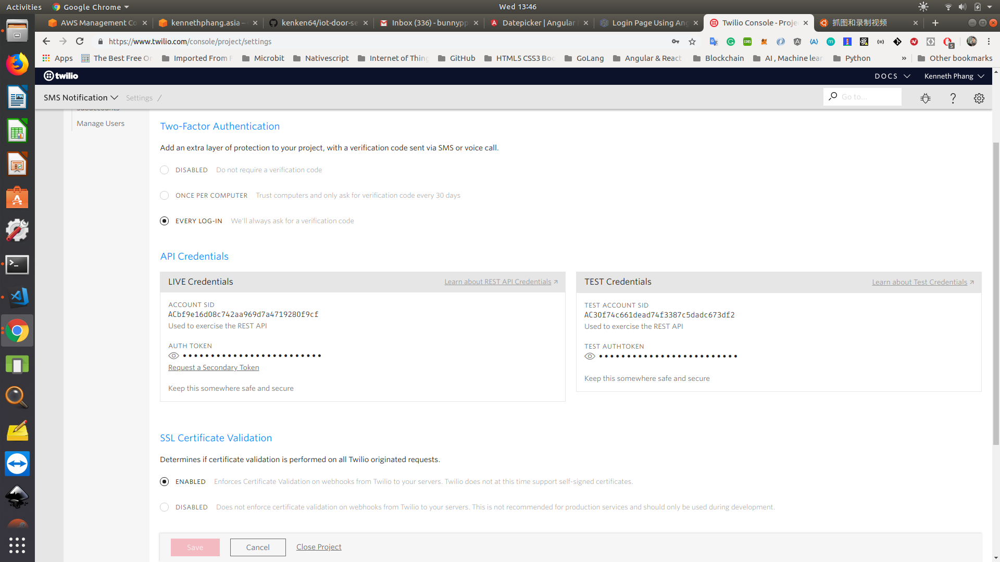
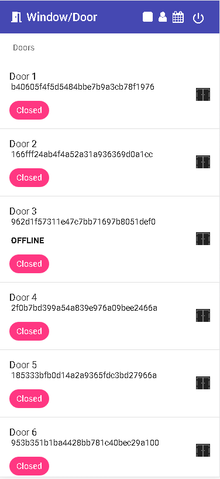

# Internet of Things  - Door/Window/Luggage Sensor

<iframe width="600" height="315"
src="https://www.youtube.com/watch?v=HDfW9AHzuwk">
</iframe>

<iframe width="600" height="315"
src="https://www.youtube.com/watch?v=pYRvByaGBP0">
</iframe>

Nothing spells security than being notified or alerted if somebody has entered your premises without your permission. It also helps when even before someone can gain entry, you already know who he or she is. The main idea of this door/window sensor is to simply provide you information if someone has gone through any of your property entry points.

## Works with Many Entry Points

The door/window sensor is primarily used to detect people or objects that have passed through the doors, but it’s also compatible to windows and any enclosures that could be opened.

## Small to Notice

The door/window sensor is a very unassuming device so it blends well with the rest of the commonly found items or appliances in your home. It is also quite small you can easily hide it well, away from the prying eyes of potential intruders, and it doesn’t get in the way with the actual functions of the entry points.

The device is a magnetic switch that allows it to accurately determine location and direction. In other words, there are no false alarms and leads.

## Very Easy and Fast Installation

As a magnetic device, it doesn’t require any intricate tools to install. In fact, you simply need to snap it into any metal part of your entryway, and you can already properly and quickly configure the door sensor. If not, you can conveniently attached even a small piece of metal at any part of the door and window.

## Works on the cloud

A connected home brings devices and services together for an integrated, autonomous experience that improves a consumer’s life. Connected home experiences include everything from window/door sensor , voice-controlled lights, house-cleaning robots, machine learning-enabled security cameras, and WiFi routers that troubleshoot for you. Thanks to decreasing costs and increasing options for connectivity, these smart home devices, sensors, and tools can be interlinked to create real-time, contextual, and smart experiences for consumers.

IoT powers the connected home by bringing new features and capabilities to smart devices, like interconnectivity, security, offline communication, predictive maintenance, analytics for consumer insights, and machine learning. Each of these capabilities play a different role in key connected home use cases such as home automation, home security and monitoring, and home networking.


# Multiple version
- Wifi version
- Sigfox version
- Lorawan version require an existing lorawan gateway

# Pre-requisite Lora Gateway
- Use the raspi-config tool (with sudo raspi-config) to enable SPI on the Raspberry Pi
- Install wiringpi (sudo apt-get install wiringpi)


# Pre-requisite microcontroller and parts
- Adafruit Huzzah ESP8266/TTGO ESP32 Wifi/Arduino UNO
- 2-way connector
- LED
- 47k Ohm Resistor
- 10k Ohm Resistor
- 220 Ohm Resistor
- Magnetic Door Sensor
- Jumper
- Custom made PCB by kenken64
- Lipo Battery/ 18650 battery
- Headers 
- UNAShield Sigfox for Arduino UNO

## 3D printed Casing/Housing
- ESP8266 STL 3d Design
- ESP32 STL 3d Design
- Sigfox STL 3d Design


# PCB Design (Eagle and Fritzing)
- WIFI Version 1
- WIFI Version 2
- Sigfox version

# Pre-requisite software & library

- Microsoft Visual Studio Code
- Node JS
- Angular 7 Cli
- Arduino IDE
- ESPBattery
- ESP 8266/32 Arduino library
- Unashield Sigfox library

# Pre-requisite Cloud account

- Twilio (require your own credit to send out SMS/WhatsApp)
- Gmail https://mail.google.com/mail/u/0/
- Google Firebase Realtime Database https://console.firebase.google.com/u/0/?pli=1
- Blynk Server 

# Twilio - SMS and WhatsApp Notification

- Create a twilio account and top up with the credits.
- Note down the twilio SSID and AUTH TOKEN.
- Purchase a number from Twilio
- Also note down the WhatsApp from number



# SMTP or Gmail account Email notification

- Create gmail account. Please do not use personal gmail account for this.
- Enable unsecure access to this account [Gmail API setting](https://support.google.com/accounts/answer/6010255?hl=en)

# Server side (AWS IOT)
- Detect door is open and closed.
- Send SMS using twilio to the configure recipient mobile number
- Send notification email to the configure recipient email address
- Detect battery is low send notification via SMS and email
- Log all events to the door's device
- Provide exportable reporting of all doors 

# Environment variable

| Env variables        | Description           | 
| ------------- |:-------------:| 
| SMTP_GMAIL_ACC      | Gmail SMTP account that use to send email to security guard  | 
| SMTP_GMAIL_PASSWORD     | Password for the above email account      |  
| TWILIO_SSID | SSID for the twilio sms APIs      |   
| TWILIO_AUTH_TOKEN | Security token for the twilio sms APIs      | 
| TWILIO_NUMBER | You need a twilio phone number in order to send SMS to the receipient      | 
| FIREBASE_DB_URL | NoSQL Database url     | 
| JOB_INTERVAL | Interval period where the job poll for the changes from firebase and the blynk APIs      | 
| JOB_TIMEOUT | Tiemout period where the job poll for the changes from firebase and the blynk APIs      | 
| NOTIFICATION_ENABLE | Disable and enable notification when door is open and closed      | 
| FIREBASE_SVC_ACC_FILE | Firebase credential file to perform admin operations     | 
| CLEAN_UP_SCHEDULE | Schedule timing to cleanup events logs     | 
| BLYNK_API_URL | Blynk IOT API URL     | 
| SIGFOX_SERVER_PORT | Sigfox callback backend server port number     |
| TWILIO_WHATSAPP_NO | Twilio WhatsApp from number     |

# Door/Window sensor Web App

## List of door/window installed with sensor




This project was generated with [Angular CLI](https://github.com/angular/angular-cli) version 7.1.4.

# PWA Web Application

## Development server

Run `ng serve` for a dev server. Navigate to `http://localhost:4200/`. The app will automatically reload if you change any of the source files.

## Code scaffolding

Run `ng generate component component-name` to generate a new component. You can also use `ng generate directive|pipe|service|class|guard|interface|enum|module`.

## Build

Run `ng build` to build the project. The build artifacts will be stored in the `dist/` directory. Use the `--prod` flag for a production build.

## Running unit tests

Run `ng test` to execute the unit tests via [Karma](https://karma-runner.github.io).

## Running end-to-end tests

Run `ng e2e` to execute the end-to-end tests via [Protractor](http://www.protractortest.org/).

## Further help

To get more help on the Angular CLI use `ng help` or go check out the [Angular CLI README](https://github.com/angular/angular-cli/blob/master/README.md).

## Start Backend server
How to start the sms and email backend server that poll the devices.

```
cd server/
pm2 start server.js --name server --max-memory-restart 1G --restart-delay 10000 --node-args="--expose-gc --max-old-space-size=4096"
```

## Start Worker for the engine
Worker consumes the job from the delegator to check the door sensors and send out notification.

```
cd server/
pm2 start worker.js --name worker --max-memory-restart 500M -- --workername=worker1 --node-args="--expose-gc
pm2 start worker.js --name worker2 --max-memory-restart 500M -- --workername=worker2 --node-args="--expose-gc
pm2 start worker.js --name worker3 --max-memory-restart 500M -- --workername=worker3 --node-args="--expose-gc
pm2 start worker.js --name worker4 --max-memory-restart 500M -- --workername=worker4 --node-args="--expose-gc
```

## Check the health of all processes
```
pm2 list
```
TODO add image

## Debug memory leakage
- Use ChromeDev Tools